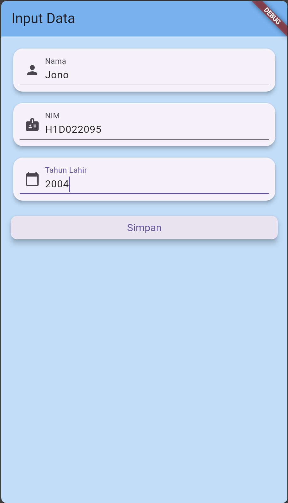
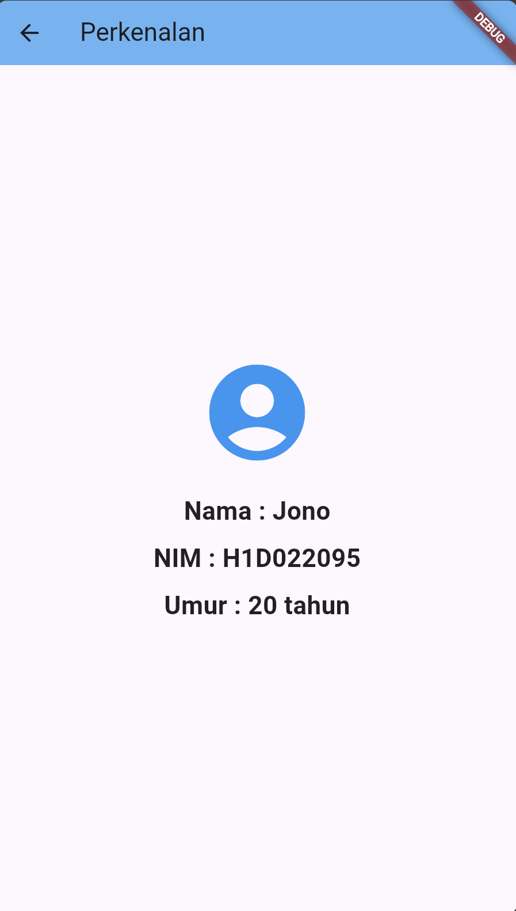

Nama : Afiftha Ravi Aufa

NIM : H1D022095

Shift Baru : A

## Proses Passing Data dari Form ke Tampilan


### 1. Input Data pada Form

Di file `form_data.dart`, terdapat beberapa `TextField` yang digunakan untuk memasukkan data: Nama, NIM, dan Tahun Lahir. Setiap `TextField` memiliki `TextEditingController()` untuk menyimpan dan memperbarui input teks dari pengguna.

```dart
final _namaController = TextEditingController();
final _nimController = TextEditingController();
final _tahunController = TextEditingController();

_textboxNama() {
  return TextField(
    decoration: const InputDecoration(labelText: "Nama"),
    controller: _namaController,
  );
}

_textboxNIM() {
  return TextField(
    decoration: const InputDecoration(labelText: "NIM"),
    controller: _nimController,
  );
}

_textboxTahun() {
  return TextField(
    decoration: const InputDecoration(labelText: "Tahun Lahir"),
    controller: _tahunController,
  );
}
```

## 2. Validasi dan Konversi

Data dari `TextEditingController()` diambil saat pengguna menekan tombol "Simpan". Jika form valid setelah `_formKey.currentState!.validate()` dipanggil, maka nilai dari masing-masing controller akan diambil dan disimpan ke dalam variabel. Selain itu, data tahun diubah menjadi integer dengan `int.parse()`

```dart
void _submitForm() {
  if (_formKey.currentState!.validate()) {
    String nama = _namaController.text;
    String nim = _nimController.text;
    int tahun = int.parse(_tahunController.text);
```

## 3. Navigasi dan Passing Data

Setelah data valid, program melakukan navigasi ke halaman baru `TampilData`, navigasi dilakukan melalui `Navigator` menggunakan `Navigator.of(context).push()` dan mengirim data melalui konstruktor.

```dart
 Navigator.of(context).push(
      PageRouteBuilder(
        pageBuilder: (context, animation, secondaryAnimation) =>
          TampilData(nama: nama, nim: nim, tahun: tahun),
```

## 4. Data diterima pada TampilData

Data yang dikirim dari form diterima `TampilData` melalui konstruktor dan disimpan dalam variabel final.

```dart
class TampilData extends StatelessWidget {
  final String nama;
  final String nim;
  final int tahun;

  const TampilData({
    super.key,
    required this.nama,
    required this.nim,
    required this.tahun,
  });

}
```

## 5. Menampilkan Data Setelah Diolah

Method build dari `TampilData` menggunakan data yang diterima untuk menampilkan informasi, data seperti nama, NIM, dan Umur (yang merupakan perhitungan dari input tahun lahir dengan cara mengurangi tahun sekarang dengan input tahun lahir `DateTime.now().year - tahun`) ditampilkan di layar.

```dart
@override
Widget build(BuildContext context) {
  final int umur = DateTime.now().year - tahun;

  _buildInfoRow(context, "Nama", nama),
  _buildInfoRow(context, "NIM", nim),
  _buildInfoRow(context, "Umur", "$umur tahun"),

}
```

## Screenshot :

<div style="display: flex; justify-content: space-between;">
  
  
</div>
